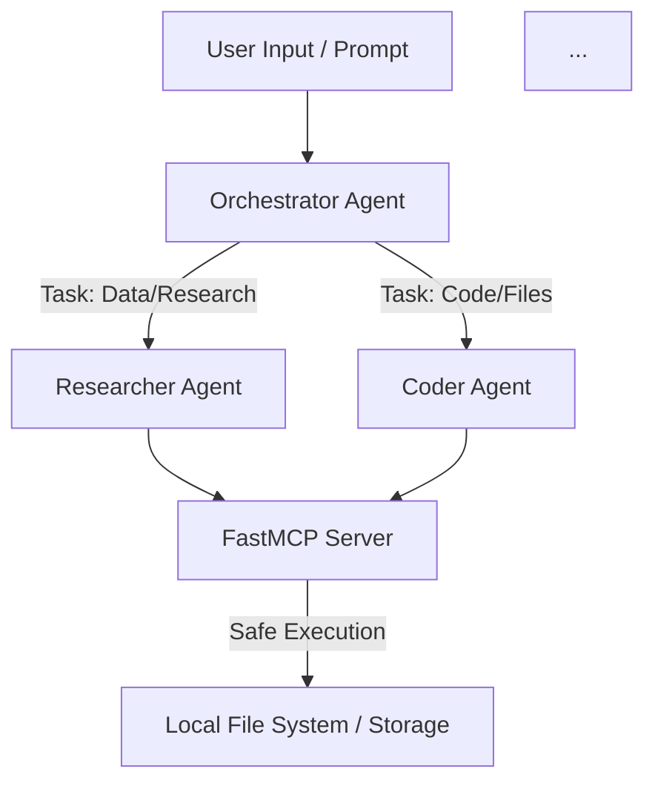

# Architecture Overview

```mermaid
graph TD
    A[User Input / Prompt] --> B[Orchestrator Agent]
...
    B -->|Task: Data/Research| C[Researcher Agent]
    B -->|Task: Code/Files| D[Coder Agent]
    C --> E[FastMCP Server]
    D --> E[FastMCP Server]
    E -->|Safe Execution| F[Local File System / Storage]
```
